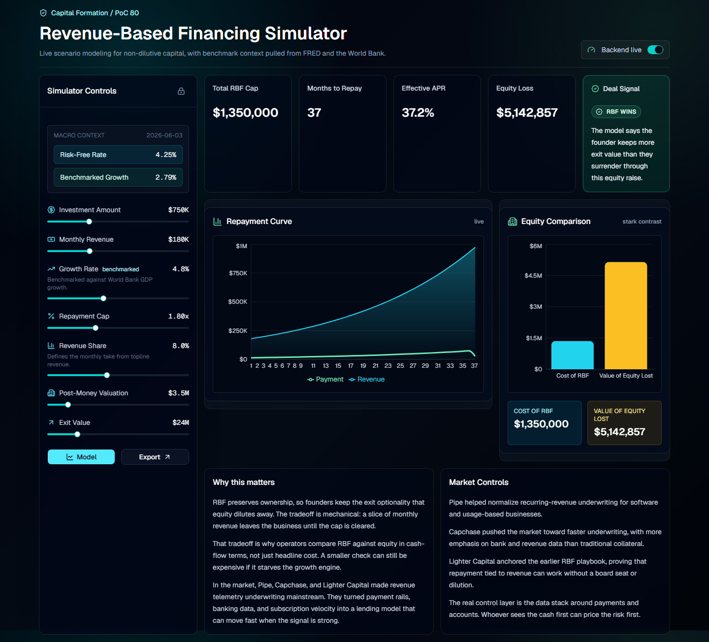
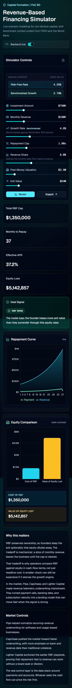

# Revenue-Based Financing Simulator

PoC #80 for the Real Rails Intelligence Library. This simulator provides a high-fidelity environment for modeling Revenue-Based Financing (RBF) contracts and comparing them against traditional equity dilution.

## 🔷 Intelligence Dashboard


*Cinematic Dark Dashboard featuring real-time RBF modeling.*

## 🎥 Demo Video

https://github.com/user-attachments/assets/7ef594b4-6eb4-4fa7-a01d-055e7586afc8

<br/>
<br/>

*Watch the simulator in action, featuring real-time data updates and cinematic transitions.*


*Responsive mobile-first storytelling.*

## 🚀 Key Features

- **Intelligence Hub:** Always-open scrollable sidebar providing real-time insights and market context.
- **Dynamic RBF Modeling:** Interactive revenue slider and contract term adjustments with instant payback curve updates.
- **Downside Stress Cases:** One-click recession simulation (Growth override) to test cash-flow resilience.
- **Equity Comparison:** Side-by-side visualization comparing RBF costs against founder ownership loss in an equity raise.
- **Macro Intelligence:** Live benchmark data fetched from **FRED** (Treasury Yields) and **World Bank** (GDP Growth).
- **Data Portability:** Export full amortization plans and sample benchmark data as CSV directly from the dashboard.
- **Deal Signal:** Algorithmic indicator identifying the most capital-efficient path.

## 🛠️ Stack

- **Frontend:** Next.js 15, TypeScript, Tailwind CSS, shadcn/ui, Recharts, Framer Motion.
- **Backend:** Python 3.14, FastAPI, Pydantic, Scipy-based bisection (IRR).

## 📖 Prerequisites

- **Python 3.14+**
- **Node.js 20+**

---

## 💻 Local Setup & Execution

### 1. Backend Setup
From the root directory:
```powershell
# Create and activate virtual environment
python -m venv .venv
.\.venv\Scripts\activate

# Install dependencies
pip install -r requirements.txt

# Start the FastAPI server
uvicorn backend.app.main:app --host 127.0.0.1 --port 8000
```
*The API will be live at `http://127.0.0.1:8000`.*

### 2. Frontend Setup
In a **new** terminal window:
```powershell
cd frontend
npm install
npm run dev
```
*The dashboard will be live at `http://127.0.0.1:3000`.*

---

## 🔍 Validation

To verify the engineering integrity of the project:

- **Logic Engine:** `pytest backend/tests`
- **User Flow (E2E):** `cd frontend; npm run test:e2e` (Ensure both servers are running first).

---

## 🧠 Why this matters

RBF is a "Success-Linked" rail. It preserves founder ownership by trading short-term cash flow for long-term equity. This tool turns complex amortization into a stark visual choice for founders and allocators.

*Build for the Intelligence Library.*
